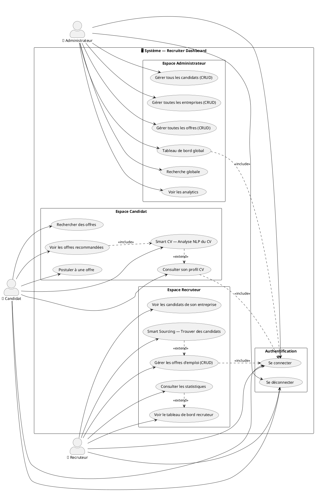
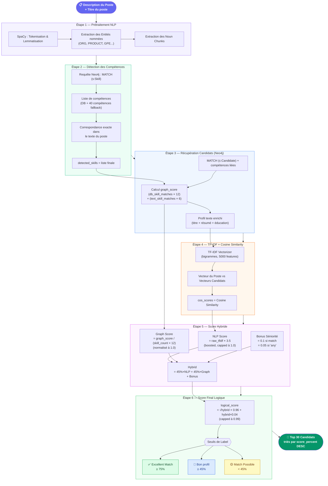
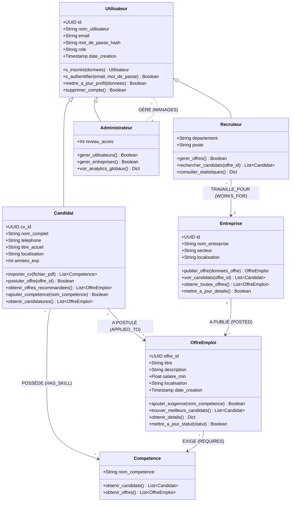
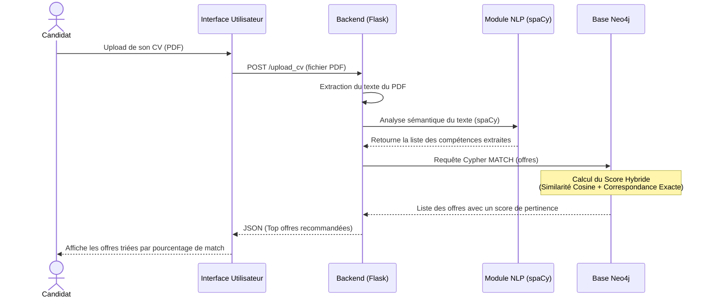
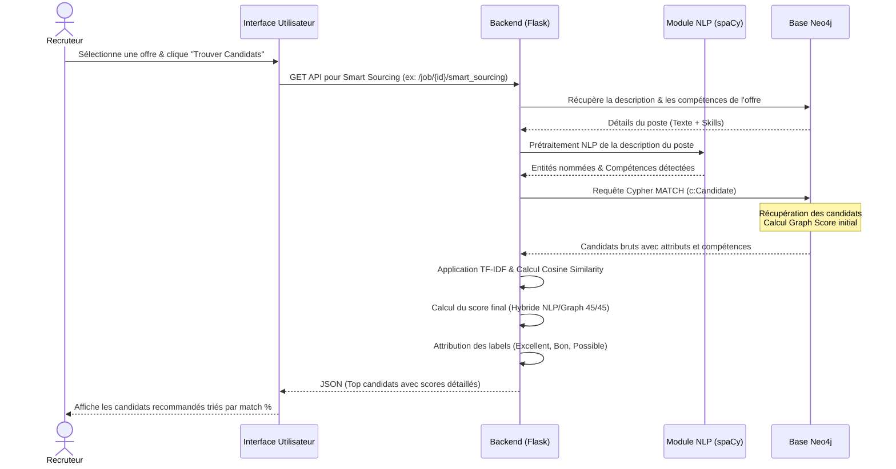
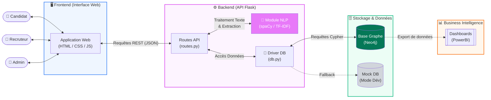

# Diagrammes du Projet — Recruiter Dashboard (Neo4j)

---

## 1. Diagramme de Cas d'Utilisation (Use Case)

---

## 2. Diagramme du Système de Scoring (Smart Sourcing)

---

## Résumé des Poids du Score Hybride

| Composante | Méthode | Poids |
|---|---|---|
| **NLP Sémantique** | TF-IDF Cosine × 3.5 (boost) | **45%** |
| **Graphe Neo4j** | Compétences matchées / Total requis | **45%** |
| **Séniorité** | Correspondance titre/niveau du poste | **10%** |
| **Mise à l'échelle** | √(hybrid) × 0.96 (racine carrée) | Finale |

> **Principe :** Le score est **absolu** (basé sur les exigences du poste) et non relatif. Un candidat qui possède toutes les compétences requises doit atteindre ~85-95% même s'il est seul dans la liste.

---

## 3. Diagramme de Classes (Modèle de Données Graphe - Neo4j)

Ce diagramme représente les entités métiers principales (Nœuds) et leurs relations dans la base de données orientée graphe.

---

## 4. Diagrammes de Séquence

### A. Smart CV : Recommandation d'offres pour un candidat
Ce diagramme illustre le processus d'analyse d'un CV uploadé par le candidat pour lui suggérer les meilleures offres correspondantes.

### B. Smart Sourcing : Recherche intelligente pour un recruteur
Ce diagramme montre comment un recruteur obtient une liste de candidats idéaux pour une de ses offres d'emploi grâce à l'algorithme hybride NLP/Graphe.

---

## 5. Architecture Globale du Projet

Ce diagramme présente l'architecture technique de l'application, montrant la séparation entre le frontend, le backend Flask, le traitement NLP et la base de données orientée graphe Neo4j.

